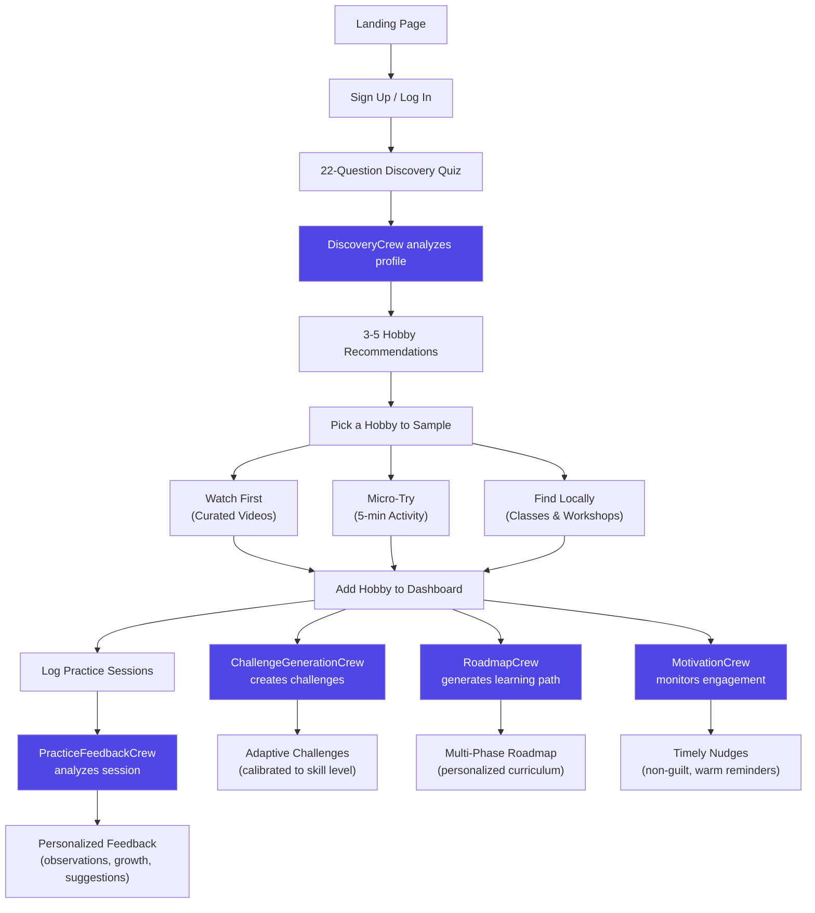
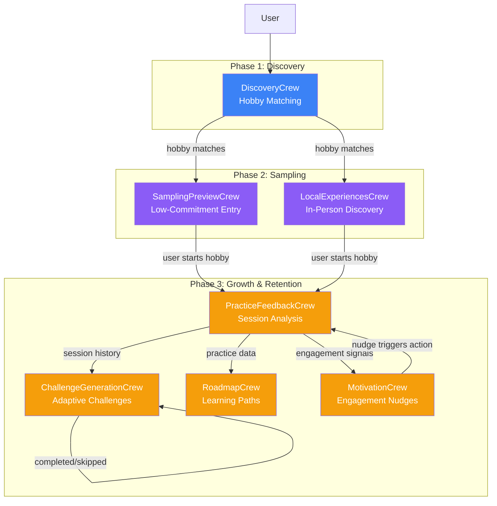
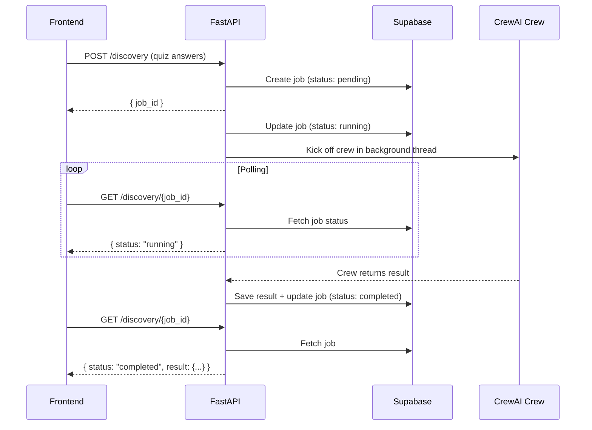
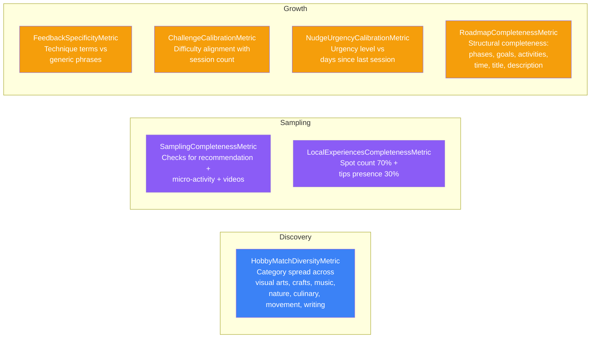
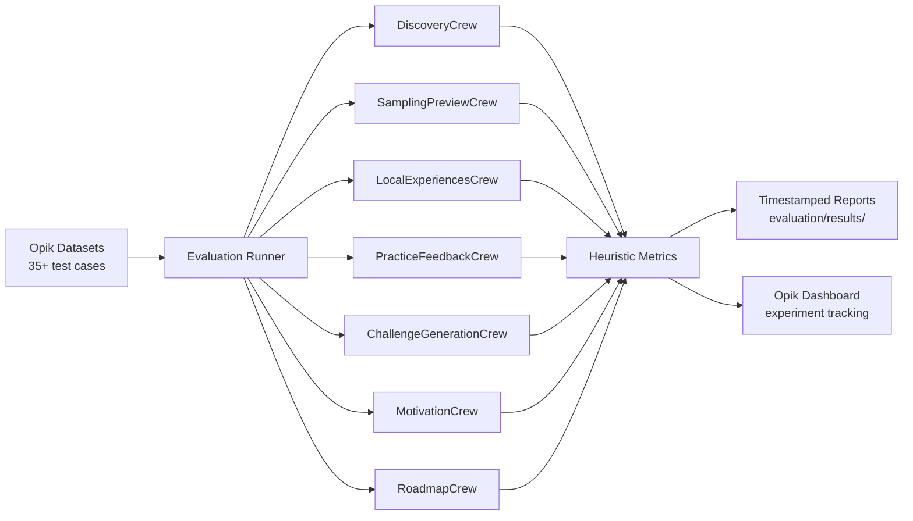
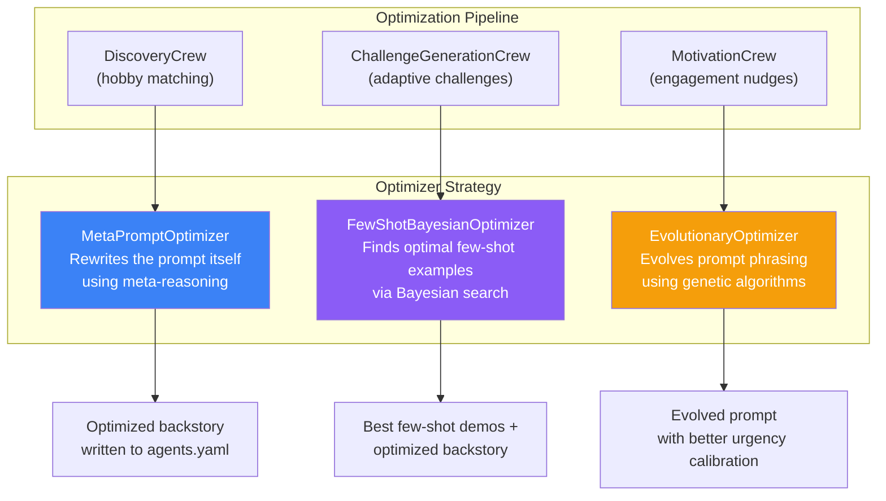

# Meraki — From Someday to Something Made

**Meraki** is an AI-powered creative hobby discovery and learning platform that helps users find fulfilling creative hobbies and sustain them through personalized guidance. Powered by a **multi-agent architecture** built on **CrewAI**, the platform orchestrates 7 specialized AI crews — each responsible for a distinct phase of the user's creative journey — from initial discovery to long-term mastery.

> *"Meraki (merakee) — to do something with soul, creativity, or love; to put something of yourself into your work."*

---

## The Problem

Most people *want* a creative hobby but never start — or quit within weeks. The barriers are real:

- **Overwhelm** — Thousands of hobbies, no way to know which fits *you*
- **High upfront commitment** — Expensive kits, long courses, pressure to "be good"
- **No guidance** — Generic tutorials that don't adapt to your skill or mood
- **Motivation decay** — Initial excitement fades, and there's no one to nudge you back
- **No structure** — No clear path from "just started" to "actually improving"

Meraki solves each of these with AI agents that work together to deliver a personalized, adaptive, and emotionally intelligent creative journey.

---

## How It Works — The User Journey



---

## Tech Stack

| Layer | Technology |
|---|---|
| **Frontend** | Next.js 16, React 19, Tailwind CSS 4, Framer Motion |
| **Backend** | FastAPI, Uvicorn |
| **AI Orchestration** | CrewAI 1.8.1 |
| **LLM Provider** | OpenAI |
| **Database & Auth** | Supabase (PostgreSQL + Auth + RLS) |
| **Observability** | Opik (tracing + evaluation) |
| **Search** | DuckDuckGo, Google Places / Maps API |

---

## Multi-Agent Architecture (CrewAI)

Meraki uses **7 specialized CrewAI crews**, each composed of purpose-built AI agents with defined roles, goals, and tools. Every crew operates as an independent unit — receiving structured input, coordinating agent tasks, and producing validated JSON output.



### Crew Details

#### 1. DiscoveryCrew — Hobby Matching

Analyzes the user's 22-question quiz responses across 9 dimensions (time & lifestyle, creative preferences, learning style, social & space, budget & commitment, motivation & mindset, sensory preferences, practical constraints, personal reflection) and produces 3-5 ranked hobby recommendations.

| Agent | Role | Tasks |
|---|---|---|
| `discovery_agent` | Hobby Discovery Specialist | Analyze profile, rank hobbies, generate recommendations |

**Output:** Ranked hobby matches with match percentage, tags, and personalized reasoning.

#### 2. SamplingPreviewCrew — Low-Commitment Entry

Creates ultra-low-barrier entry points so users can *taste* a hobby before committing. Recommends one of three pathways based on personality signals.

| Agent | Role | Tasks |
|---|---|---|
| `sampling_preview_agent` | Hobby Sampling Facilitator | Recommend path, generate micro-activity, curate YouTube videos |

**Three Sampling Paths:**
- **Watch First** — Curated beginner-friendly videos (passive, visual learners)
- **Micro-Try** — 5-minute hands-on activity, zero materials needed (hands-on learners)
- **Find Locally** — In-person classes and workshops (social learners)

#### 3. LocalExperiencesCrew — In-Person Discovery

Searches for welcoming local studios, workshops, meetups, and classes using Google Places and web search. Returns practical beginner tips (what to wear, bring, expect).

| Agent | Role | Tools |
|---|---|---|
| `local_experiences_agent` | Local Experience Finder | `google_places_search`, `web_search` |

#### 4. PracticeFeedbackCrew — Session Analysis

Provides warm, specific, and encouraging feedback on logged practice sessions. Analyzes session metadata, recent history, completed challenges, and optional photos of the user's work.

| Agent | Role | Output |
|---|---|---|
| `practice_analyst` | Creative Practice Analyst | Observations, growth signs, suggestions, celebration |

#### 5. ChallengeGenerationCrew — Adaptive Challenges

Designs perfectly-calibrated creative challenges that push growth without overwhelming. Difficulty scales based on session count, mood trends, and completed/skipped challenge history.

| Agent | Role | Output |
|---|---|---|
| `challenge_designer` | Creative Challenge Designer | Title, description, difficulty, skills, tips, learning outcomes |

**Calibration Logic:**
```
< 5 sessions   ->  "easy"    (confidence-building)
5-15 sessions   ->  "medium"  (creative constraints)
> 15 sessions   ->  "hard"    (push boundaries)
Frustrated?     ->  lower difficulty, focus on fun
Excited?        ->  push harder
```

#### 6. RoadmapCrew — Learning Paths

Creates structured, multi-phase learning roadmaps personalized to the user's current skill level and practice history. Phase titles are inspirational ("Finding Your Voice"), not academic ("Module 3").

| Agent | Role | Output |
|---|---|---|
| `roadmap_designer` | Learning Path Designer | Phases with goals, activities, and weekly time estimates |

#### 7. MotivationCrew — Engagement Nudges

Monitors engagement signals and delivers perfectly-timed, non-guilt motivation nudges using behavioral psychology principles.

| Agent | Role | Output |
|---|---|---|
| `motivation_specialist` | Creative Motivation Specialist | Nudge type, message, suggested action, urgency |

**Urgency Calibration:**
```
1-3 days inactive   ->  "gentle"     (warm reminder)
4-7 days inactive   ->  "check_in"   (caring check-in)
7+ days inactive    ->  "re_engage"  (fresh-start invitation)
```

---

## Async Job Architecture

All crew executions run as **async background jobs** to handle CrewAI's processing time gracefully.



**Job States:** `pending` -> `running` -> `completed` | `failed`

All results are persisted to their respective Supabase tables (hobby_matches, sampling_results, challenges, roadmaps, nudges, etc.) for subsequent use across the platform.

---

## Opik Integration — Observability, Evaluation & Optimization

[Opik](https://www.comet.com/site/products/opik/) is integrated across three pillars: **automatic tracing** of all CrewAI agent activity, **systematic evaluation** of output quality, and **prompt optimization** to continuously improve agent performance.

### Tracing

Opik is initialized at server startup and automatically traces every CrewAI crew execution:

```python
from opik.integrations.crewai import track_crewai

opik.configure(use_local=False)
track_crewai(project_name="meraki")
```

Every agent step, tool call, and LLM interaction is captured and visible in the Opik dashboard under the `meraki` project — providing full visibility into agent reasoning, token usage, and latency.

### Custom Evaluation Metrics

Meraki defines **7 custom heuristic metrics** to score AI output quality without requiring LLM judges:



| Metric | What It Measures | Scoring |
|---|---|---|
| **HobbyMatchDiversityMetric** | Category spread of recommendations | `min(1.0, matched_categories / 3)` across 7 hobby categories |
| **SamplingCompletenessMetric** | Presence of all 3 sampling sections | `found_sections / 3` |
| **LocalExperiencesCompletenessMetric** | Spot count + tips presence | `0.7 * spot_score + 0.3 * tips_score` |
| **FeedbackSpecificityMetric** | Technique terms vs generic phrases | Rewards specificity, penalizes "great job" / "well done" |
| **ChallengeCalibrationMetric** | Difficulty alignment with user level | Compares expected difficulty by session count |
| **NudgeUrgencyCalibrationMetric** | Urgency appropriateness | Matches urgency to days since last session |
| **RoadmapCompletenessMetric** | Structural quality | `passed_checks / 6` (phases, goals, activities, time, title, description) |

### Evaluation Datasets & Runner

The `evaluation/` directory contains a full batch evaluation system:

- **`datasets.py`** — Defines **7 persistent Opik datasets** with 35+ curated test cases, covering edge cases like contradictory quiz signals, rural locations, frustrated users, and advanced practitioners.
- **`run_evaluation.py`** — Runs all crews against their datasets, scores with heuristic metrics, and saves timestamped experiment reports to `evaluation/results/`.



### Agent Prompt Optimization

Beyond evaluation, Meraki uses **opik-optimizer** to automatically improve agent prompts. Three different optimization strategies are applied — each chosen to match the nature of the crew being optimized:



| Crew | Optimizer | Why This Strategy |
|---|---|---|
| **DiscoveryCrew** | `MetaPromptOptimizer` | The discovery prompt is complex (9-dimension analysis). Meta-reasoning rewrites the entire system prompt to improve how the agent reasons about user profiles. |
| **ChallengeGenerationCrew** | `FewShotBayesianOptimizer` | Challenge design benefits from concrete examples. Bayesian search finds the optimal set of 2-5 few-shot demonstrations that best calibrate difficulty and creativity. |
| **MotivationCrew** | `EvolutionaryOptimizer` | Nudge tone is subtle and hard to specify directly. Genetic algorithms explore novel phrasings and urgency calibrations that would be hard to hand-author. |

**How it works:**

1. Each optimizer loads the current agent backstory from `agents.yaml`
2. Runs the prompt against a curated Opik dataset (quiz profiles, challenge scenarios, or engagement signals)
3. Scores each trial using `AnswerRelevance` against expected outputs
4. After all trials, reports `initial_score -> best_score` with improvement percentage
5. Optionally writes the optimized prompt back to `agents.yaml` (with `--apply`)

**Run all optimizations:**

```bash
# Dry run — optimize and save results without modifying agent configs
uv run python -m meraki_flow.optimization.run_all

# Apply optimized prompts directly to agents.yaml files
uv run python -m meraki_flow.optimization.run_all --apply

# Run specific optimizers only
uv run python -m meraki_flow.optimization.run_all --only discovery motivation

# Control trial count
uv run python -m meraki_flow.optimization.run_all --trials 20
```

Results (initial vs. best scores, optimized prompts, few-shot demonstrations) are saved as timestamped JSON files in `optimization/results/`.

---

## API Endpoints

All endpoints follow a **POST to create job -> GET to poll result** pattern.

| Method | Endpoint | Crew | Description |
|---|---|---|---|
| `POST` | `/discovery` | DiscoveryCrew | Submit quiz answers for hobby matching |
| `GET` | `/discovery/{job_id}` | — | Poll discovery results |
| `POST` | `/sampling/preview` | SamplingPreviewCrew | Generate sampling pathways for a hobby |
| `GET` | `/sampling/preview/{job_id}` | — | Poll sampling results |
| `POST` | `/sampling/local` | LocalExperiencesCrew | Find local classes & workshops |
| `GET` | `/sampling/local/{job_id}` | — | Poll local experience results |
| `POST` | `/practice/feedback` | PracticeFeedbackCrew | Get AI feedback on a practice session |
| `GET` | `/practice/feedback/{job_id}` | — | Poll feedback results |
| `POST` | `/challenges/generate` | ChallengeGenerationCrew | Generate a calibrated challenge |
| `GET` | `/challenges/generate/{job_id}` | — | Poll challenge results |
| `POST` | `/motivation/check` | MotivationCrew | Check engagement and generate nudge |
| `GET` | `/motivation/check/{job_id}` | — | Poll nudge results |
| `POST` | `/roadmap/generate` | RoadmapCrew | Generate a learning roadmap |
| `GET` | `/roadmap/generate/{job_id}` | — | Poll roadmap results |
| `GET` | `/health` | — | Health check |

---

## Project Structure

```
Meraki/
├── backend/
│   └── src/meraki_flow/
│       ├── api.py                          # FastAPI server & endpoints
│       ├── db.py                           # Supabase client & persistence
│       ├── models.py                       # Pydantic output models
│       ├── opik_setup.py                   # Opik initialization & CrewAI tracing
│       ├── opik_metrics.py                 # 7 custom evaluation metrics
│       ├── crews/
│       │   ├── discovery_crew/             # Hobby recommendation
│       │   ├── sampling_preview_crew/      # Low-commitment sampling
│       │   ├── local_experiences_crew/     # In-person discovery
│       │   ├── practice_feedback_crew/     # Session analysis
│       │   ├── challenge_generation_crew/  # Adaptive challenges
│       │   ├── motivation_crew/            # Engagement nudges
│       │   └── roadmap_crew/              # Learning paths
│       ├── evaluation/
│       │   ├── datasets.py                 # 7 Opik evaluation datasets
│       │   └── run_evaluation.py           # Batch evaluation runner
│       └── optimization/                   # Prompt optimization utilities
│
├── frontend/
│   └── src/
│       ├── app/
│       │   ├── auth/                       # Login, signup, password reset
│       │   ├── discover/                   # Quiz, results, sampling flows
│       │   ├── dashboard/                  # Hub, sessions, challenges, roadmap
│       │   └── actions/                    # Server actions (Supabase queries)
│       ├── components/
│       │   ├── landing/                    # Hero, Problem, Solution sections
│       │   ├── dashboard/                  # Nav, modals, cards, nudges
│       │   ├── discover/                   # Quiz, sampling, results components
│       │   └── ui/                         # Shared UI primitives
│       ├── hooks/                          # Custom React hooks
│       └── lib/                            # Utilities, types, data transforms
│
└── frontend/supabase/migrations/           # Database schema migrations
```

---

## Getting Started

### Prerequisites

- Python 3.10+
- Node.js 18+
- A Supabase project
- Anthropic API key (Claude)
- Google API key (for local experiences)
- Opik API key (optional, for observability)

### Environment Variables

**Backend** — create `backend/.env`:
```env
ANTHROPIC_API_KEY=sk-ant-...
SUPABASE_URL=https://your-project.supabase.co
SUPABASE_SERVICE_ROLE_KEY=eyJ...
GOOGLE_API_KEY=AIza...
OPIK_API_KEY=...
CORS_ORIGINS=http://localhost:3000
```

**Frontend** — create `frontend/.env.local`:
```env
NEXT_PUBLIC_SUPABASE_URL=https://your-project.supabase.co
NEXT_PUBLIC_SUPABASE_ANON_KEY=eyJ...
```

### Run the Backend

```bash
cd backend
pip install -e .
python -m meraki_flow.api
# Server starts on http://localhost:8000
```

### Run the Frontend

```bash
cd frontend
npm install
npm run dev
# App starts on http://localhost:3000
```

### Run Evaluations

```bash
cd backend
python -m meraki_flow.evaluation.run_evaluation
# Results saved to evaluation/results/
```
